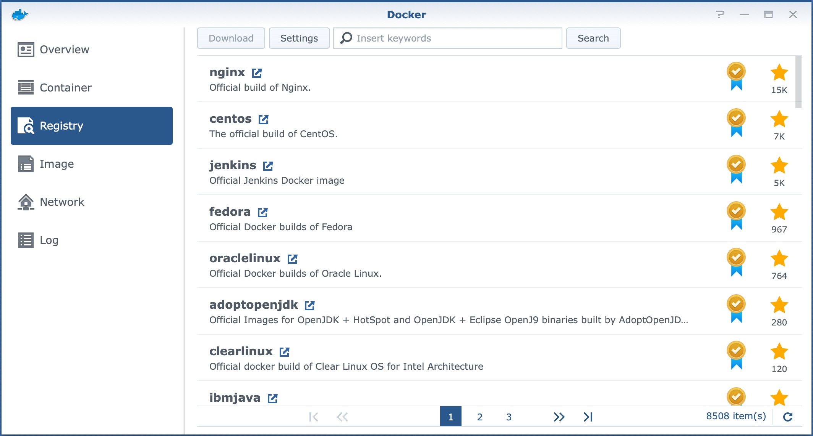
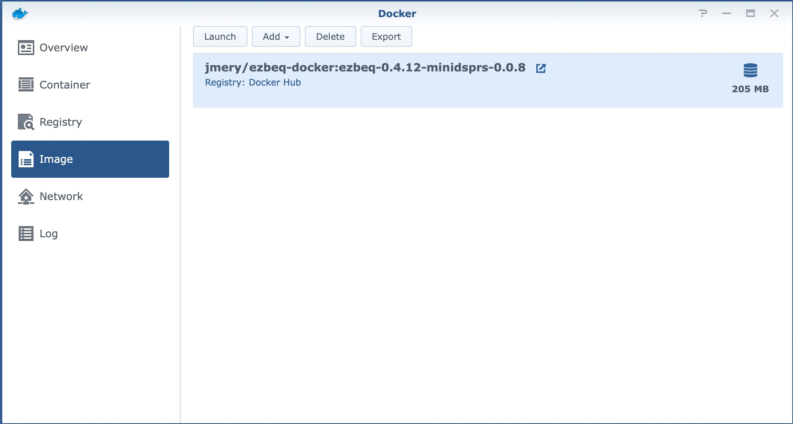
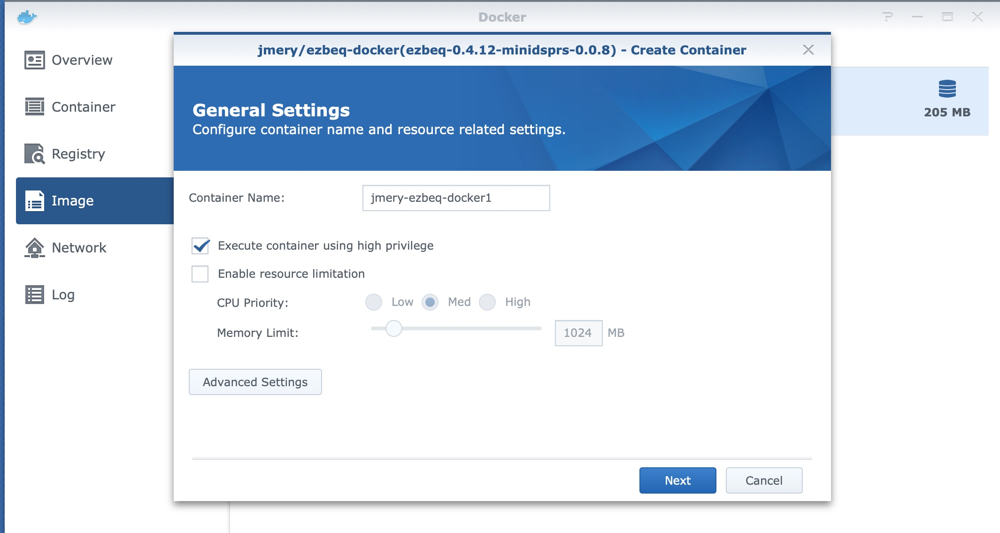
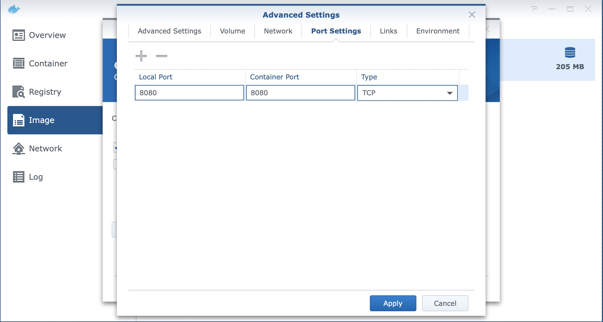
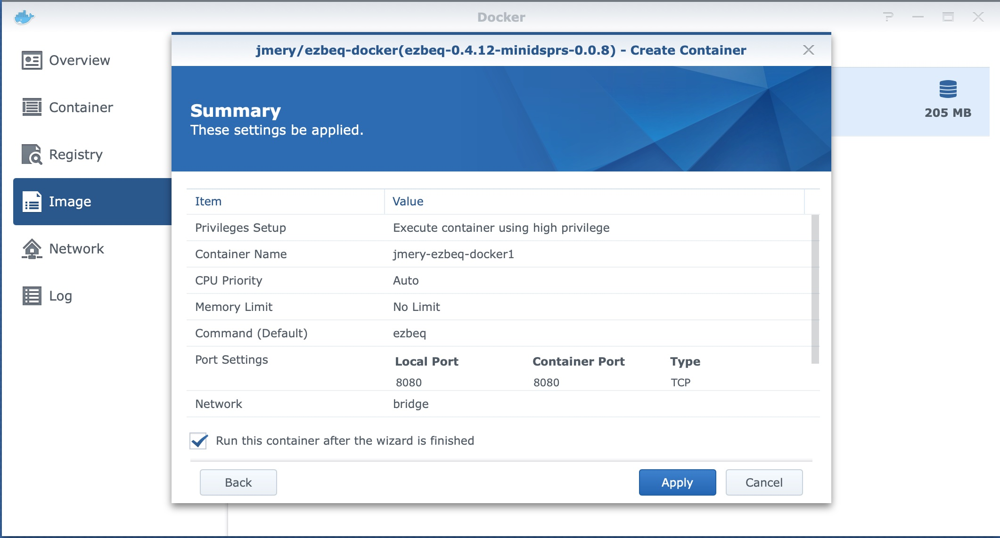

# Running ezBEQ in Docker on Linux or Synology Diskstation

I built this for me because I'm lazy and needed to simplify the number of devices in my AV rack.  I currently build the containers manually using releast versions of `minidsp-rs` and `ezbeq` (i.e., I only build for what's considered "stable" and don't build pre-release versions).  At some point, I may automate builds such that combinations of new versions of minidsp-rs and ezBEQ automatically have a container built for them.

Feel free to open an issue if you find a problem.  Feel free to code a fix and submit a PR as well :-).  Feel free to fork this and do what you want with it.

## General Linux Docker Instructions

CONTAINER_NAME = name of your container (e.g., `mydockerhub/ezbeq-docker`)

First build the container that you're going to run.  Within same directory as Dockerfile run the following:

```docker build -t CONTAINER_NAME .```

Optionally, push the container to docker hub with `docker push CONTAINER_NAME`

We need to find the path to the miniDSP so we can expose it to the running container when the container is launched.  These commands may vary based on your host OS.  Using Ubuntu as an example:

1. Run `lsusb`
2. Look for the miniDSP device
3. Note the Bus and Device numbers

In the example below, the Bus number is `001` and the Device number is `003`.

```
jmery@ubuntu:~/src/ezbeq$ lsusb
Bus 001 Device 003: ID 2752:0011 miniDSP miniDSP 2x4HD
Bus 001 Device 002: ID 0e0f:000b VMware, Inc. VMware Virtual USB Video Device
Bus 001 Device 001: ID 1d6b:0002 Linux Foundation 2.0 root hub
Bus 002 Device 004: ID 0e0f:0008 VMware, Inc. Virtual Bluetooth Adapter
Bus 002 Device 003: ID 0e0f:0002 VMware, Inc. Virtual USB Hub
Bus 002 Device 002: ID 0e0f:0003 VMware, Inc. Virtual Mouse
Bus 002 Device 001: ID 1d6b:0001 Linux Foundation 1.1 root hub
jmery@ubuntu:~/src/ezbeq$ 
```

Run to lauch the container.  Replace BUS_NUMBER, DEVICE_NUMBER, and CONTAINER_NAME with your unique values used or found above.

```docker run -it --device=/dev/bus/usb/BUS_NUMBER/DEVICE_NUMBER -p 8080:8080 CONTAINER_NAME```

## Synology NAS Instructions
 
You will need to have the container image above published on hub.docker.com in order to use it on the Synology NAS device.  It is best to build and pull your own image.  As an alternative, you can pull `jmery/ezbeq-docker`.  It is provided as-is.

If these instructions don't provide enough detail, should you really be doing/attempting this?

1. Plug your miniDSP into the Synology NAS using the USB cable
1. Using "Package Center" on the Synology NAS, install the official "Docker" package.
2. After install, open the Docker app and select "Registry"
   
3. Search for your container in the registry 
4. After finding the container, select "Download" to pull the container down
    * If the image has multiple tags, select the appropriate version combination you want to use.  Otherwise, just choose "latest"
5. In the Docker app UI, select "Image"
   
6. Choose the image you want and select "Launch"
    * Give the container a special name if you like
    * Be sure to select "Execute container using high privilege" <--- Note on this below!
    
7. Select "Advanced Settings"
    * Check the box to "Enable auto-restart"
    * Select "Port Settings"
    * Map port `8080` from the host to the container port `8080`
    * Select "Apply"
    
8. Verify the settings and select "Apply"
   

At this point, the a container is being created from the image and is being launched.  Depending on the power of your NAS and what it's doing at the time, the start up can be nearly instant or take a minute.

After a minute or two, point a browser at `http://yournas:8080`.   You should be able to see ezBEQ running.  Try to change slots and make sure things are working.  If you see `ERROR` reported for any of the slots check the following:

* Did you plug your miniDSP into the Synology via USB?
* Did you launch the container with "Execute container using high privilge" enabled?

### Note on "Execute container using high privilege"

This is a terrible way to do this, but there isn't a better option on the Synology NAS.  On Linux, as you can see from those instructions, we can limit what the container sees on the USB bus with the `--device` option.  The container can only see the single device we give it permission to see.

Technically, we can also do this on the Synology, but it has some problems.  The main issue is that it must be done from the command line AND as soon as you disconnect, the container will be killed and won't run; no ezBEQ for you!  To get around this we must launch the container with the Docker UI.  The only option it provides is full privileged so we have to use that.

The downside of using privilged, is that the container can see *everything* on the USB bus (and probably more).  If the container is compromised, you are risking access to your sytem and data!

Always verify what's in the containers you're running!  The dockerfile used to build this container is on github.  It's about as simple as it gets.  I'm sure there's a better way to do things `FROM scratch` or whatever, but I'm not going down that route right now.